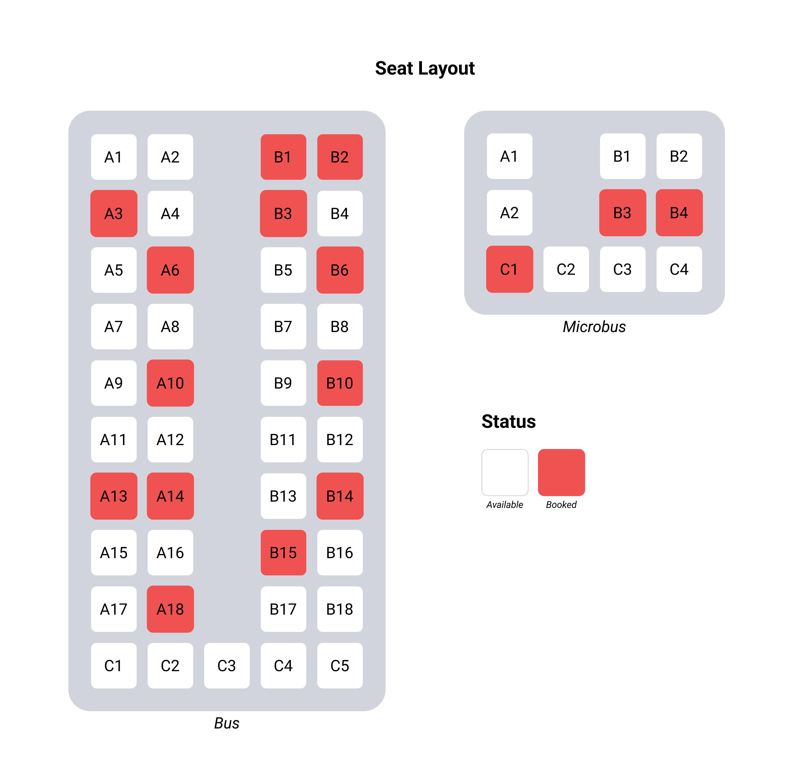

# Assessment Task

You are tasked with building an online vehicle booking platform that allows users to book seats for various vehicles (for now you can consider two types of vehicle as shown in the diagram below), such as buses or micros. The platform needs to dynamically generate seat layouts for different vehicle types, handle user bookings, and manage backend functionalities. Your goal is to create a scalable and efficient system that provides a smooth user experience.

## Frontend Requirements

1. Seat Layout Display: Create a frontend interface that dynamically generates and displays the seat layout for each vehicle type. The frontend should show available and booked seats, and allow users to select and book available seats.
2. Seat Selection: Enable users to select multiple seats (based on the vehicle's configuration) within a single booking transaction. Provide a visually intuitive interface for seat selection.
3. Booking Confirmation: After seat selection, the frontend should display a summary of the selected seats and the booking details.
4. Error Handling: Implement proper error handling and user feedback mechanisms to handle cases like overlapping bookings, invalid seat selections, or server-side errors gracefully.

## Backend Requirements

1. API Endpoints: Develop a backend server that exposes RESTful API endpoints to handle seat availability, seat booking. Use appropriate HTTP methods for each endpoint (e.g., GET for fetching seat availability, POST for booking seats).
2. Database Schema: Design an appropriate database schema to store information about vehicles, seats, and bookings. Use a relational database like MySQL or PostgreSQL.
3. Seat Generation Algorithm: Implement a backend algorithm that dynamically generates seat layouts for different vehicle types (e.g., buses with multiple rows and columns of seats). The algorithm should consider different vehicle configurations, such as aisle seats, window seats, etc (For now you can implement for two types of vehicle as shown in the diagram). 
4. Seat Booking Management: Develop backend logic to manage seat bookings, including checking seat availability, handling concurrent bookings, and updating the seat status after successful bookings.

## Additional Considerations:
1. Security: Implement secure coding practices to protect user data and prevent common security vulnerabilities, such as SQL injection or cross-site scripting (XSS) attacks.
2. Error Logging: Implement logging mechanisms to record critical errors and exceptions for easier troubleshooting and maintenance.
3. Documentation: Provide clear and comprehensive documentation for the API endpoints, data models, and frontend components to help future development and maintenance.

## Evaluation:
Your solution will be evaluated based on the following criteria:

- Correctness and completeness of the functional requirements.
- Efficiency and scalability of the backend algorithms and data structures.
- User-friendly frontend interface.
- Proper error handling and feedback mechanisms.
- Code quality, maintainability, and adherence to coding best practices.
- Documentation clarity and completeness.

## Preferable tech stacks 
- PHP or NodeJs as backend framework
- VueJs or ReactJs as frontend framework

## How to share your code?
- Use this template to create a new private repository
- Provide access to your newly created repo to rajen@bookmundi.com, anuj@bookmundi.com and ankit@bookmundi.com
